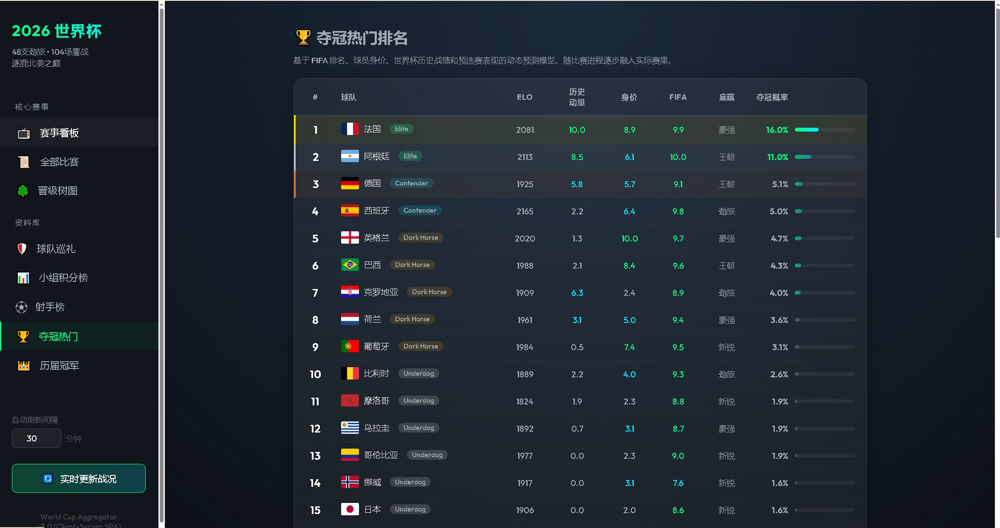
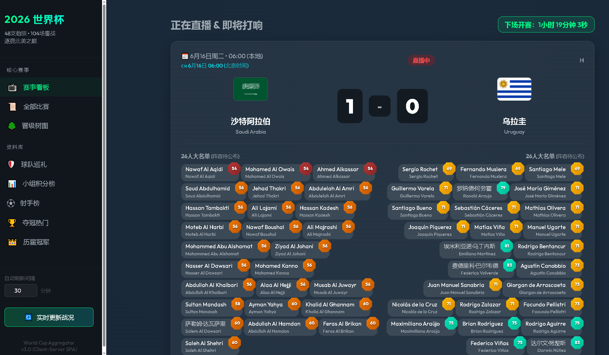
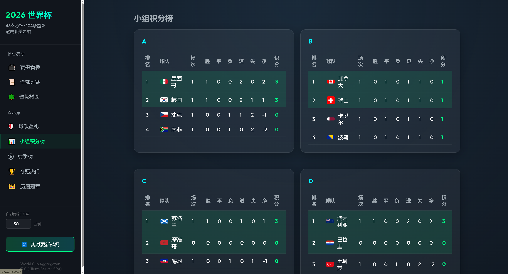
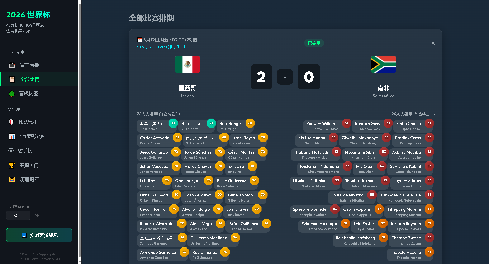
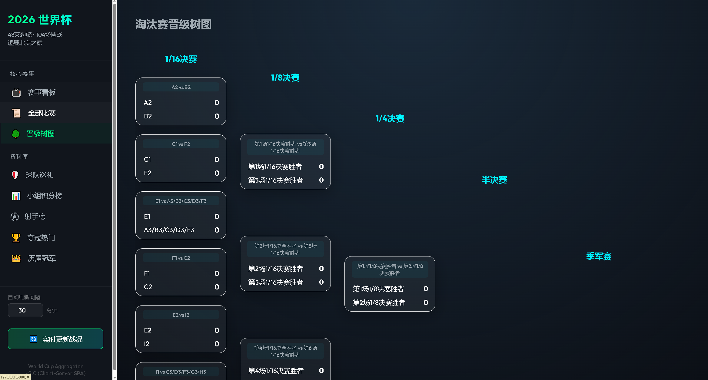
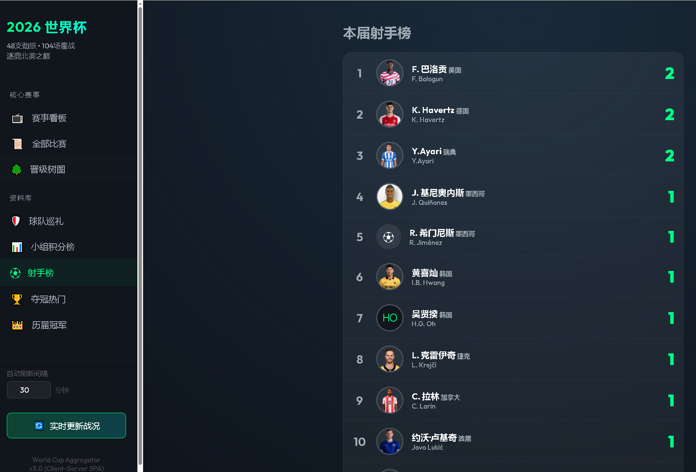
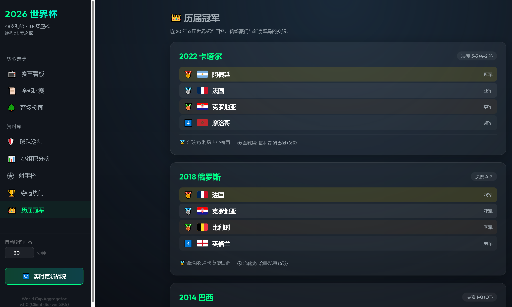

# World Cup 2026 Schedule Aggregator

世界杯 2026 赛程汇总系统 — 一个基于 Flask + Vanilla JS SPA 架构的赛程数据聚合与可视化平台。

## 功能特性

8 大核心视图，完整覆盖赛程生命周期：

| 视图 | 说明 |
|---|---|
| 赛事看板 | 即将开始 + 正在进行中的比赛，实时倒计时 |
| 全部比赛 | 所有比赛完整时间表 |
| 晋级树图 | 淘汰赛阶段对阵可视化 |
| 球队巡礼 | 48 支球队卡片网格展示 |
| 小组积分榜 | 12 个小组实时排名（胜/平/负/净胜球/积分） |
| 射手榜 | 按进球数排序的实时射手榜 |
| 夺冠热门 | 多因子概率模型（ELO + 时衰减历史动量 + 身价 + FIFA 排名） |
| 历届冠军 | 2002-2022 六届世界杯回顾 |

## 截图预览

### 🏆 多因子夺冠热门排名
基于 ELO（30%）+ 历史动量（35%，半衰期 8 年）+ 身价（20%）+ FIFA 排名（15%）的综合模型：



### ⚽ 赛事看板（实时直播）
实时比赛状态 + 26 人大名单阵容展示：



### 📊 小组积分榜
12 个小组实时排名，自动计算积分、净胜球：



### 📅 全部比赛排期
小组赛第 1–3 轮 + 淘汰赛完整对阵时间表：



### 🌳 淘汰赛晋级树图
1/16 → 1/8 → 1/4 → 半决赛 → 决赛，含待定对阵标签：



### 🥇 射手榜
实时进球排名，数据来自 worldcup26.ir API。展示球员头像、中英文名、所属球队、进球数，点击可查看球员详情弹窗（含 Wikipedia 传记和 TheSportsDB 高清头像）：



### 👑 历届世界杯冠军
2002–2022 六届冠亚季殿军，含金球奖与金靴奖：



> **截图文件对应**：`snap_number1.png` 夺冠热门 | `snap_number1_hst.png` 历届冠军 | `snap_doing.png` 赛事看板 | `snap_total.png` 积分榜 | `snap_all_rate.png` 全部排期 | `snap_168421.png` 晋级树 | `snap_ss.png` 射手榜

## 技术栈

- **后端**：Python 3.13 + Flask 3.1
- **数据库**：SQLite 3
- **前端**：Vanilla JavaScript SPA（无框架依赖）
- **样式**：暗色主题 CSS，赛博朋克风格
- **反爬**：Scrapling StealthyFetcher

## 数据来源

- [dongqiudi.com](https://www.dongqiudi.com) — 比赛时间（北京时间权威），赛程阶段与淘汰赛对阵
- [worldcup26.ir](https://worldcup26.ir) REST API — 实时比分与射手数据（JWT 认证）
- [TheSportsDB](https://www.thesportsdb.com) — 球员肖像、Fanart
- [Wikipedia REST API](https://en.wikipedia.org/api/rest_v1/) — 球员英文传记

## 快速开始

### 前置条件

- Python 3.9+
- PowerShell（Windows）或 Bash（macOS/Linux）

### 方式一：快速启动（已有数据库）

```powershell
.\Start-WorldCupServer.ps1
```

自动安装依赖并启动 Flask 服务 → 访问 `http://127.0.0.1:5000`

### 方式二：首次搭建（无数据库）

```powershell
.\Setup-WorldCup.ps1
```

完整流水线：安装依赖 → 初始化数据库 → 数据抓取 → 启动服务

### 手动启动

```bash
# 安装依赖
pip install -r src/requirements.txt

# 初始化数据库
python src/init_db.py

# （可选）导入初始数据
python src/scrape_and_store.py --mode init

# 启动服务器
python src/app.py
```

### 环境变量配置

复制 `.env.example` 为 `.env`，填入 `worldcup26.ir` 的凭证（可选，用于 API 实时数据同步）：

```
WC2026_EMAIL=your_email@example.com
WC2026_PASSWORD=your_password
```

## 项目结构

```
project_root/
├── src/                        # 源代码目录
│   ├── app.py                  # Flask 服务入口
│   ├── data_adapter.py         # worldcup26.ir API 集成层
│   ├── data_service.py         # 数据查询与夺冠概率计算
│   ├── dongqiudi_fetcher.py    # 懂球帝赛程抓取（北京时间→UTC）
│   ├── init_db.py              # SQLite 建表与迁移
│   ├── import_squads.py        # 48 队大名单导入器
│   ├── scrape_and_store.py     # 数据管道与调度
│   ├── requirements.txt        # Python 依赖
│   ├── power_ranking_data.json # ELO/FIFA/身价静态数据
│   ├── static/
│   │   ├── css/style.css       # 暗色主题样式
│   │   └── js/app.js           # SPA 前端逻辑
│   └── templates/
│       └── index.html          # SPA 入口模板
├── Start-WorldCupServer.ps1    # 快速启动脚本
├── Setup-WorldCup.ps1          # 首次搭建全流程脚本
├── .env.example                # 环境变量模板
├── .gitignore
├── LICENSE
├── README.md
└── CHANGELOG.md
```

运行时产物（不入库）：
- `worldcup2026.db` — SQLite 数据库
- `.wc2026_token.json` — API Token 缓存

## API 文档

| 端点 | 方法 | 说明 |
|---|---|---|
| `/` | GET | SPA 首页 |
| `/api/data` | GET | 所有核心数据（球队/球员/比赛/转播） |
| `/api/power_ranking` | GET | 多因子夺冠概率排名（含 ELO/历史/身价/FIFA 分项得分） |
| `/api/player_ratings` | GET | 球员 0-100 能力评级 |
| `/api/trigger_scrape` | POST | 手动触发数据更新 |
| `/api/settings` | GET/POST | 读取/设置刷新间隔（1-60 分钟） |

## 冠军概率模型

4 因子融合基线 + 阶段权重曲线 + Softmax 概率化：

1. **ELO 评分 (30%)**：当前竞技实力，min-max 标准化到 0-10
2. **历史动量 (35%)**：2002-2022 六届世界杯冠亚季殿军计分，半衰期 8 年指数衰减（2022 权 1.0→2002 权 0.19）
3. **身价评分 (20%)**：阵容市场价值标准化
4. **FIFA 排名 (15%)**：官方排名逆序标准化
5. **阶段权重曲线**：小组赛 weight=0 → 1/16 → 0.20 → 半决赛 → 0.65 → 决赛 → 0.80（赛会表现逐步取代基线）
6. **复合公式**：`composite = (1-weight) × baseline + weight × 赛会表现`
7. **Softmax T=2.5** → 概率分布
8. **四级分层**：Elite / Contender / Dark Horse / Underdog

## 开源许可

[MIT License](LICENSE)
